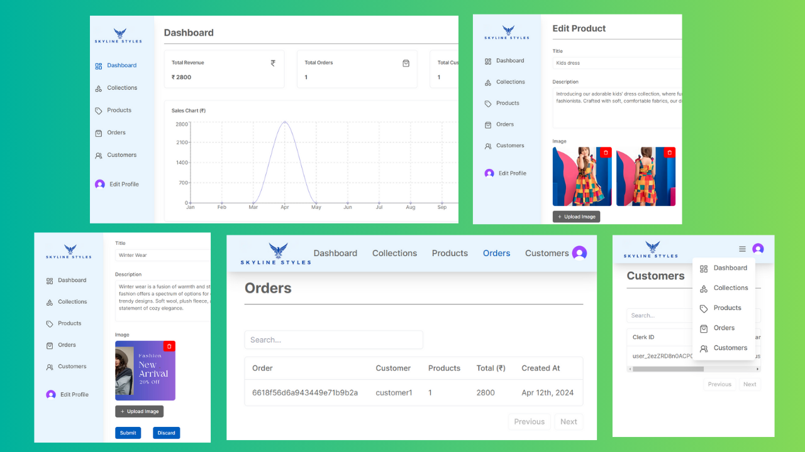

# Skyline-Styles Admin Web application: Full stack web application for admin dashboard

Developed an E-commerce admin web application using Next.js 14 for high performance. Integrated Stripe for secure payments, utilized TypeScript and MongoDB for efficient data management, and Clerk for authentication. Implemented React-Hook-Form for form validation, Tailwind CSS & Shadcn UI for responsive design, and Next Cloudinary for image upload/storage.

## Technologies Utilized

- **Next.js 14**
- **Stripe**
- **TypeScript**
- **MongoDB**
- **Clerk**
- **React**
- **Tailwind CSS**
- **Cloudinary**

## Deployment

This web application is deployed on Vercel. 
